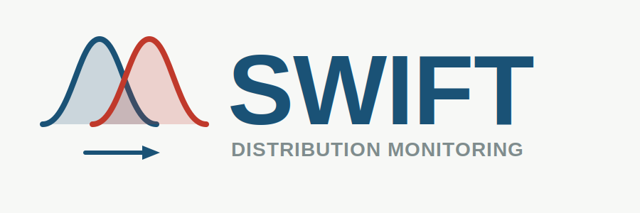
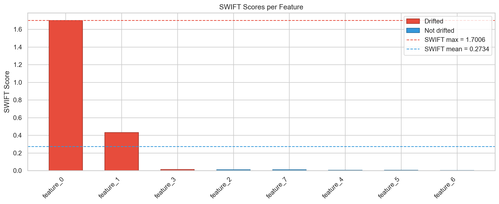
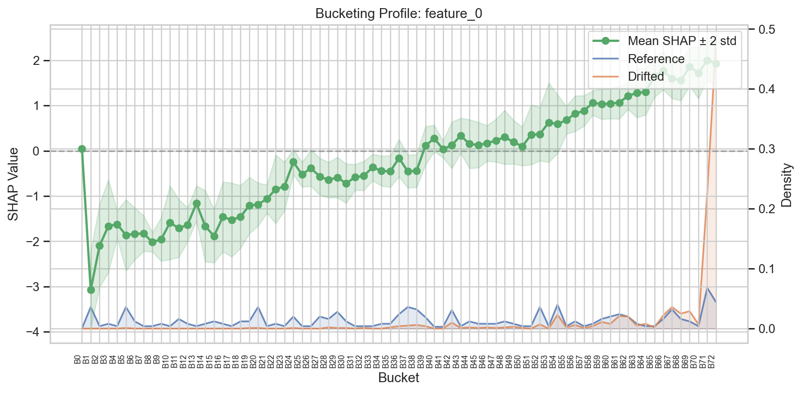

# SWIFT

<p align="center">
  
</p>

**SHAP-Weighted Impact Feature Testing for Model-Aware Distribution Monitoring**

---

SWIFT detects feature drift by comparing SHAP-transformed distributions between reference and monitoring data. Unlike traditional drift detection that treats features independently of the model, SWIFT weights distribution changes by their impact on model predictions — flagging only the shifts that affect model behavior.

## Why SWIFT?

Traditional distribution monitoring methods (KS test, PSI, etc.) detect *any* statistical shift, regardless of whether it matters to the model. SWIFT solves this by:

- **Using SHAP values** to weight each feature region by its impact on predictions
- **Focusing on model-relevant drift** — ignoring benign distribution changes
- **Providing statistical rigor** with permutation tests and multiple testing correction
- **Integrating with scikit-learn** via the familiar `fit` / `transform` / `score` API

## Quick Example

```python
from swift import SWIFTMonitor

# Create monitor with a trained tree-ensemble model
monitor = SWIFTMonitor(model=lgb_model, n_permutations=200)

# Fit on reference data (stages 1-3)
monitor.fit(X_ref)

# Test monitoring data for drift (stages 4-5)
result = monitor.test(X_mon)
print(result.drifted_features)
```

### Example Output

<figure markdown="span">
  { width="100%" }
  <figcaption>SWIFT scores per feature — drifted features highlighted in red</figcaption>
</figure>

<figure markdown="span">
  { width="100%" }
  <figcaption>Bucket profile showing SHAP response curve and density shift for a drifted feature</figcaption>
</figure>

## The Pipeline at a Glance

| Stage | Operation | Description |
|-------|-----------|-------------|
| 1 | **Extraction** | Extract decision points (split thresholds) from the trained model |
| 2 | **Bucketing** | Partition each feature's domain into buckets based on decision points |
| 3 | **SHAP Normalization** | Compute bucket-level mean SHAP values on reference data |
| 4 | **Wasserstein Distance** | Measure distance between SHAP-transformed distributions |
| 5 | **Permutation Test + MTC** | Estimate p-values and apply multiple testing correction |

Stages 1-3 run during `fit()`. Stages 4-5 run during `test()`.

[Learn more about the pipeline :material-arrow-right:](user-guide/pipeline.md){ .md-button }

## Project Structure

```
swift/
├── src/swift/
│   ├── __init__.py          # Public API exports
│   ├── pipeline.py          # SWIFTMonitor (main entry point)
│   ├── plotting.py          # Visualization functions
│   ├── extraction.py        # Stage 1: Decision point extraction
│   ├── bucketing.py         # Stage 2: Bucket construction
│   ├── normalization.py     # Stage 3: SHAP normalization
│   ├── distance.py          # Stage 4: Wasserstein distance
│   ├── threshold.py         # Stage 5: Permutation test + MTC
│   ├── aggregation.py       # Model-level score aggregation
│   └── types.py             # Data types (BucketSet, SWIFTResult, etc.)
├── tests/                   # Test suite
├── experiments/             # Experiment runners
└── pyproject.toml
```

## Citation

```bibtex
@article{swift2025,
  title={SWIFT: SHAP-Weighted Impact Feature Testing for Model-Aware Distribution Monitoring},
  year={2025}
}
```
